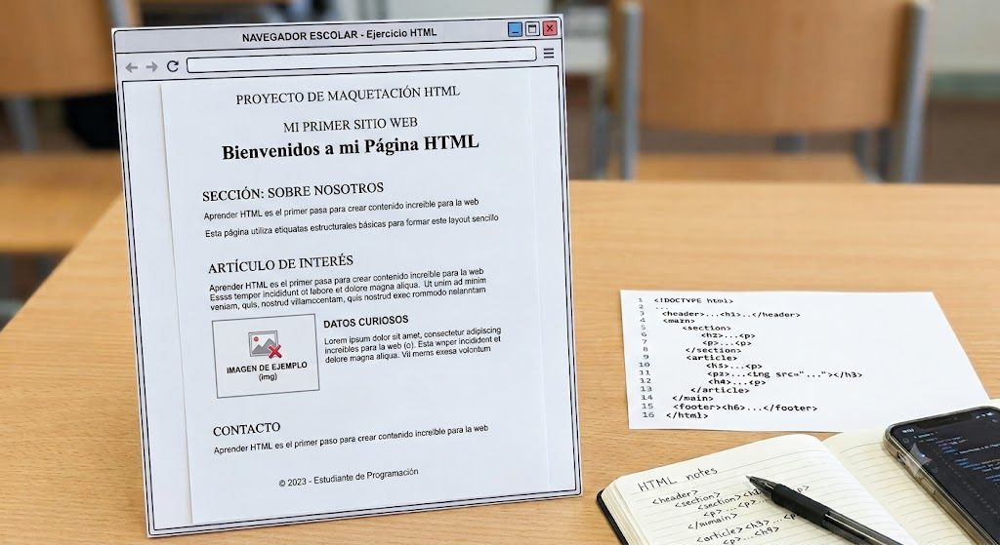

# 🚀 Desafío 01: Tu Primer Sitio Web con HTML Puro

¡Bienvenido/a a tu primer desafío de maquetación web! En esta tarea vas a construir la estructura fundamental de un sitio web utilizando **únicamente HTML semántico**, tal como se vería en un navegador sin aplicar estilos de CSS.

---

## 📸 Modelo de Referencia

A continuación se muestra el layout de referencia que podés tomar como guía para estructurar tu página. Tené en cuenta que **no debes usar CSS**: el diseño debe ser el resultado natural de la jerarquía de las etiquetas HTML utilizadas.

---

## 🎯 Objetivo
El objetivo de este ejercicio es aplicar y afianzar las etiquetas y la jerarquía de un documento HTML vistas en clase, creando una estructura clara, organizada e intuitiva para el usuario.

> 💡 **Nota sobre la temática:** La temática del sitio es **100% libre**. Podés elegir un tema que te guste (un blog personal, una tienda, una página sobre un hobby, una película, un juego, un proyecto personal, etc.). Lo importante es mantener la estructura requerida.

---

## 🛠️ Etiquetas e Historias de Usuario (Requisitos)

Tu código debe ser un archivo `index.html` válido que contenga y utilice adecuadamente **todas** las siguientes etiquetas vistas:

1. **Estructura global y metadatos:**
   - Declaración de tipo de documento: `<!DOCTYPE html>`
   - Etiqueta raíz: `<html>`
   - Encabezado técnico del documento: `<head>` (debe incluir la etiqueta `<title>` con el nombre de tu sitio)
   - Cuerpo de la página: `<body>`

2. **Estructura semántica del contenido:**
   - Encabezado principal del sitio: `<header>`
   - Bloque de contenido principal: `<main>`
   - Pie de página: `<footer>`

3. **Organización del contenido dentro de `<main>`:**
   - Al menos **dos secciones** distintas delimitadas con la etiqueta `<section>`.
   - Al menos **un artículo** independiente definido con la etiqueta `<article>`.

4. **Elementos de texto y multimedia:**
   - Uso correcto y jerárquico de títulos: desde `<h1>` hasta `<h6>` (no es obligatorio usar los 6 niveles, pero sí respetar el orden lógico de jerarquía).
   - Múltiples párrafos de texto utilizando `
`.
   - Al menos **una imagen** agregada con la etiqueta `` (recordá incluir los atributos `src` y `alt`).

---

## 🚫 Reglas y Restricciones

- **Sin CSS:** No agregues archivos `.css`, etiquetas `<style>` ni atributos `style=""` en las etiquetas. La página debe renderizarse con la tipografía y disposición predeterminada del navegador (tal como se muestra en la imagen de referencia).
- **Semántica limpia:** Cada etiqueta debe cumplir su función real. No uses encabezados (`<h2>`, `<h3>`) solo para agrandar texto, ni párrafos (`
`) para subtítulos.

---

## 📥 Entregables

1. Archivo comprimido `.zip` o enlace a tu repositorio conteniendo el archivo `index.html`.
2. Las imágenes utilizadas deben guardarse localmente en una carpeta de tu proyecto.

¡Mucho éxito con tu primera maquetación! 💻